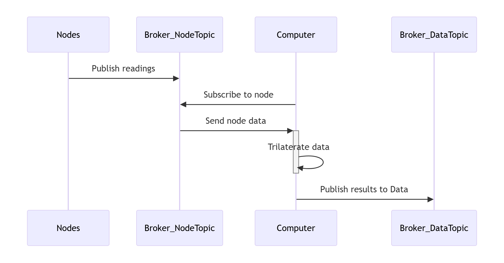

# Report: Positioning devices without GPS coverage

**Authors:** Dikshya, Jonas & Tatiana

**Date:** 2025-12-04 

## Abstract
This report describes a small indoor positioning system made with ESP32 IoT nodes that detect nearby devices and estimate their position without GPS. The system collects Wi-Fi RSSI measurements from multiple nodes, sends them to a local MQTT server, and uses a simple trilateration method to calculate approximate (x, y) coordinates. Tests at known locations showed that the system can detect devices and provide rough position estimates, though accuracy is limited by indoor signal noise and MAC address randomisation. The report also summarises key GDPR considerations, including the handling of MAC addresses as personal data.

## Introduction
Indoor positioning is challenging because GPS signals are unreliable or unavailable inside buildings. Many applications—such as monitoring device presence, occupancy, or asset tracking—require knowing a device’s location even without GPS.

The problem addressed in this project is how to estimate the position of mobile devices indoors using only local Wi-Fi signals. Challenges include signal variability, multipath effects, limited ESP32 memory, and MAC address randomisation, which can affect detection and data collection.

The objective of this project is to build a simple IoT system using multiple ESP32 nodes that can detect nearby devices, collect signal data, and estimate their approximate (x, y) position. The system also considers privacy and GDPR implications, ensuring that data collection minimises personal information while remaining functional.

## System Architecture

**Sequence Diagram – Short Description**

The sequence diagram shows how data flows through our positioning system. Each IoT node publishes its RSSI readings to a specific MQTT topic on the local broker. The computer subscribes to the node topics and receives the incoming measurements from the broker. Once the computer has collected data from multiple nodes, it performs the trilateration calculation locally to estimate the device position. After computing the result, the computer publishes the processed position data to a separate MQTT data topic, where it can be visualized or logged.

## Hardware & Software

**Hardware**
 The system is based on ESP32 IoT devices equipped with Wi-Fi capabilities, used to detect nearby devices by scanning for Wi-Fi probe requests. Multiple ESP32 nodes are deployed at strategic locations to measure the RSSI (Received Signal Strength Indicator) from nearby mobile devices. This data is transmitted to an MQTT server for further processing.

**Software:** The development is done using the Arduino IDE with libraries such as ArduinoJson for data serialization and PubSubClient (MQTT) for publishing data. The trilateration algorithm uses the RSSI data from multiple nodes to estimate the device's position. The system is designed to comply with GDPR regulations by hashing MAC addresses to ensure privacy.

The software handles data collection, processing, and transmission, with a focus on minimizing personal data collection to comply with GDPR regulations.

## Process & Technologies
**Technologies Used:**
**Wi-Fi Sniffing:** RSSI values are captured using ESP32 nodes in promiscuous mode to detect Wi-Fi probe requests.

**Trilateration:** Using the RSSI values from at least three different ESP32 nodes, distances are estimated, and a trilateration algorithm is applied to calculate the approximate (x, y) position of the device.

**MQTT Protocol:** Data is sent from ESP32 nodes to a local MQTT broker, where it is processed and stored for visualization or further analysis.

**Development Process:** The project was developed iteratively, starting with basic data collection, followed by implementation of the trilateration algorithm and testing the system for accuracy in indoor environments.

**Data Serialization:** **JSON** is used to format and transmit data between ESP32 nodes and the processing pipeline.

**Programming Languages:**
- **C++** for ESP32 firmware and JSON serialization.
- **C#** for the central data processing pipeline, including trilateration and visualization.

**json** **c++** **#c**

## Data Collection

**Captured Data**

The ESP32 nodes capture the following information for each detected Wi-Fi signal:
    
1.  **Node ID / MAC** – Identifies the detected device sending the Wi-Fi probe. This is personal data under GDPR.
    
3.  **Timestamp** – Records when the packet was captured, enabling temporal correlation between nodes.
    
4.  **RSSI (Received Signal Strength Indicator)** – Measures signal strength of the detected device; crucial for estimating distances in trilateration.
    
5.  **Payload / Additional Data** – Contains numeric readings or counters sent by the device, used for monitoring and debugging.
    
6.  **Position (x, y)** – Calculated in the pipeline after trilateration, representing the estimated location of the detected device.
    

### Why It Matters

*   **RSSI values** are directly used to estimate distances between nodes and target devices, which is fundamental for trilateration.
    
*   **Timestamps** allow synchronization of measurements across multiple nodes to accurately reconstruct movement and location.
    
*   **NodeID** ensure that measurements can be traced back to specific nodes and devices while maintaining privacy via hashing.
    
*   **Payload** provides additional context for testing, debugging, or validating signal data.
    
*   **Position** is the main output for the system, used for evaluating trilateration accuracy.
    

Capturing these fields ensures that the system has all the necessary information to calculate positions, analyze signal behavior, and debug issues effectively.

### How Calibration Was Performed

1.  **JSON Formatting & Validation:**
    
    *   Data is serialized into JSON for consistent structure and deserialized at the pipeline.
        
    *   Malformed messages are detected and discarded, ensuring only valid data is used.
        
2.  **RSSI Calibration:**
    
    *   RSSI values were compared against known distances under controlled conditions to establish a mapping from signal strength to distance.
        
    *   Calibration curves or reference measurements were used to correct for environmental factors like interference or signal attenuation.
        
3.  **Pipeline Testing:**
    
    *   Received JSON messages are processed in the pipeline, and positions are calculated using trilateration algorithms.
        
    *   Comparison with ground truth or known node positions allows verification and adjustment of calculations.
        
4.  **Memory and Processing Considerations:**
    
    *   Payload size and message frequency were optimized to prevent ESP32 crashes, ensuring consistent and reliable data capture during calibration tests.

## Positioning Method
The project estimates the positions of detected Wi-Fi devices using RSSI-based trilateration. Each device’s signal strength is measured at three fixed anchor nodes with known coordinates. These RSSI values are converted into distances using a log-distance path loss model:
>d = 10^((RSSI\_ref - RSSI) / (10 × n))

#### Where:
*   d= estimated distance (meters)
    
*   RSSI\_ref= reference RSSI at 1 meter
    
*   RSSI= measured signal strength
    
*   n= path-loss exponent, calibrated experimentally
    

#### Typical Values used in this project:
- Indoor Environment
>n = 2.0 - 4.0
>**RSSI\_ref = -69 dBm

- Outdoor Environment
>n = 2.0 - 3.0
>RSSI\_ref = -82 dBm

**Trilateration Mathematics**
Given distances d0,d1,d2d\_0, d\_1, d\_2d0​,d1​,d2​ to three anchors at positions (x0,y0),(x1,y1),(x2,y2)(x\_0, y\_0), (x\_1, y\_1), (x\_2, y\_2)(x0​,y0​),(x1​,y1​),(x2​,y2​), the device position (x,y)(x, y)(x,y) is found by solving:
>(x - xᵢ)² + (y - yᵢ)² = dᵢ², i = 0, 1, 2

This can be solved using a linearized least-squares approach, yielding:

>x = (CE - BF) / (AE - BD)y = (AF - CD) / (AE - BD)

#### Matrix Coefficients:

>A = 2(x₁ - x₀)B = 2(y₁ - y₀)C = d₀² - d₁² - x₀² + x₁² - y₀² + y₁²
>
>D = 2(x₂ - x₀)E = 2(y₂ - y₀)F = d₀² - d₂² - x₀² + x₂² - y₀² + y₂²

**Output:** The system returns the estimated (x, y) coordinates of the device, which can be visualised as a heatmap or used for further analysis.

The chosen positioning approach and the mathematical formulation.

## Privacy & GDPR

This project collects data from nearby wireless devices (Wi-Fi probes). Because some of this data relates to individuals, we evaluate it under **GDPR**.

### What data is personal?

- **MAC** addresses are personal data because they identify a device used by a person.

- **RSSI**, timestamp, and node position are not personal on their own, but become personal when linked to a **MAC** address.

> **_Conclusion:_** 
**MAC** = personal data.
**MAC** + **RSSI**/time/location = personal movement data.
---

### Is the data sensitive?

No. **MAC** addresses are ordinary personal data, not sensitive categories (health, biometrics, religion, etc.).

### When is the data personal?

- Static MACs → clearly personal.
- Randomized MACs → still personal, but lower identification risk.

In practice: MACs are treated as personal data at all times.

### Does combining **MAC** + time + place enrich the data?

Yes. Adding timestamps and node positions creates movement patterns, such as:

- Visits
- Duration of stay
- Repeated presence
- Devices moving together

This increases the responsibility for proper handling.

### Impact on data responsibility

Because movement patterns can relate to individuals, we must:

- limit what we collect
- avoid identification
- delete data quickly
- pseudonymize/anonymize whenever possible

## How we could minimize data (**GDPR** compliance)
> To reduce personal data risks when handling MAC addresses, the following measures are recommended:
> **1. No raw MAC addresses stored**
> - MACs are hashed (e.g., **SHA**-**256** + salt) before storage.
>
> **2. Only necessary data collected We store only:**
>
> - hashed MAC
> - RSSI
> - timestamp
> - node ID
>
> We do not store: device type, manufacturer (**OUI**), full history, or other network details.
>
> **3. Short retention.**
> - Data is kept only for tests (e.g., 24–48 hours) or in memory.
>
>**4. No identification attempts.**
> - We never try to link devices to real people.
>
> 5. **Used only for the project purpose.**
> Data is used solely for:
> - position estimation
> - signal analysis
> - accuracy testing
>
>### Overall assessment.
>
>The project processes personal data (**MAC** addresses and derived movement information). It is not sensitive, but still protected. We reduce risk through hashing, minimal data collection, short retention, and strict purpose limitation. This aligns with the **GDPR** principles of dataminimization, purpose limitation, and risk reduction.
>

## Experiments & Results
This section presents the experimental setup, observations, and insights gained during the project.

**Test Setup**
- ESP32 Nodes: Three nodes placed at known coordinates, -operating in Wi-Fi promiscuous mode to capture nearby device signals.
- Data Flow: Nodes publish RSSI measurements and device identifiers to dedicated MQTT topics.
- Backend: A central computer subscribes to the MQTT topics, performs trilateration, and processes the incoming data.
- Data Logged: RSSI, timestamps, node coordinates, and anonymized device identifiers.

## Observations & Data Flow Challenges
This project revealed several limitations and areas for improvement in the design and implementation of the indoor positioning system.

**Data Flow Challenges.**
During initial attempts, we tried using the device pipeline directly to handle incoming data from the **ESP32** nodes. This approach proved unreliable: data was often lost or incorrectly processed due to issues in the pipeline configuration. Switching to a direct **MQTT** broker approach improved reliability, allowing subscriber callbacks to correctly receive and process incoming messages for trilateration.

> Lessons learned:
>- Ensuring a stable and correctly configured data flow is critical for accurate position estimation.
>- Callback functions must be thoroughly tested to confirm that all messages from the nodes are processed without loss.

**ESP32 Limitations.**
Our original design considered each **ESP32** node acting as both publisher and subscriber, forwarding data through multiple brokers. This proved impractical because:
-   The **ESP32**’s limited memory and processing capacity caused bottlenecks.
-   Complex message routing introduced risks of loops and increased latency.

> Lesson learned:
>- Assigning multiple responsibilities to resource-constrained devices increases the risk of data loss and system instability.

**Proposed Improvements.**
Based on these observations, we adopted a simpler, more robust approach:

**ESP32** nodes act solely as publishers, sending data to dedicated **MQTT** topics.
A central computer runs a C# application that subscribes to the topics, performs trilateration, and processes incoming data.

This separation of responsibilities reduces load on the nodes, simplifies debugging, and ensures a reliable and scalable data flow.

**Observations from Logs**
From our experiment logs:

- Subscriber callbacks successfully received and processed node data for trilateration.

- Using queues on the server side allows orderly processing, even if nodes send bursts of data.

- Moving the pipeline to a central computer provides flexibility for data analysis, visualization, and **GDPR**-compliant handling.

**Limitations and Future Work.**
Indoor **RSSI** measurements remain noisy due to multipath effects, reflections, and **MAC** address randomization.

Trilateration accuracy depends on proper calibration of the path-loss exponent and reference **RSSI**.

>**Future improvements could include:**
>- Adding more anchor nodes to reduce positional error.
>- Implementing filtering or smoothing of **RSSI** measurements.
>- Exploring fingerprinting methods to improve indoor positioning accuracy.

## Conclusion

Although the project did not reach full functionality, we made significant progress in understanding how WiFi sniffing, MQTT communication, and trilateration can work together in an indoor positioning system. We successfully captured packets, published data from ESP32 nodes, and built a C# pipeline to process incoming measurements. However, a critical issue with sorting the payloads in the C# application prevents proper synchronization of data, which blocks the final trilateration step.

Throughout the project, we learned that our original system design—where each ESP32 acted as both publisher and subscriber—was too complex and placed unnecessary load on the devices. Moving the processing pipeline to a central computer proved to be a much more stable and scalable approach. We also realized that creating a sequence diagram earlier would have clarified the data flow and saved time during development.

In addition to the technical work, we had valuable discussions about GDPR and how handling MAC addresses and location data requires careful consideration of privacy, data minimization, and pseudonymization.

Even though the final system is not fully completed, the project provided important insights into IoT architecture, data processing challenges, and responsible handling of personal data.

## References

>**Technical / IoT Resources**
>
>- ESP32 official documentation (Arduino / ESP-IDF)
>- MQTT protocol documentation (Mosquitto)
>- Wi-Fi Sniffer Examples:
>- Demo of Wi-Fi sniffer using generative AI (Claude): demo_kode/Proximity sniffer
>   - GitHub: IndoorPos_opgave_noter
>   - GitHub: ESP32 Sniffer by ETS-PoliTO
>- MQTT Server:
>   - Local MQTT server set up in the teaching lab
>   - Optionally, personal/local MQTT server can be used during development
>
>**GDPR Regulation (EU 2016/679)**
>
>- Article 4(1) – Definition of personal data
>- Article 4(5) – Pseudonymisation
>- Article 5 – Data minimisation, purpose limitation, storage limitation
>- Article 9 – Special categories of data
>- Article 25 – Data Protection by Design and by Default
>- Recital 26 – Identifiability and data combination
>- Recital 30 – Online identifiers (e.g., MAC and IP addresses)
>
>**Danish Data Protection Authority (Datatilsynet)**
>
>- Guidance on logging, IP addresses and identifiers (confirming that IP and MAC addresses are personal data)
>- Statements on location data as personal data
>
>**European Data Protection Board (EDPB)**
>
>- Guidelines on online identifiers (MAC addresses, device IDs, cookies)
>
>**Article 29 Working Party (WP29)**
>
>- Opinion 05/2014 on Anonymisation Techniques (hashing = pseudonymisation, not anonymisation)
>- Opinions on online identifiers as personal data
>
>**Mathematics / Trilateration**
>- SpringerLink. RSSI-based indoor positioning methods. Available at: https://link.springer.com/article/10.1186/s13673-020-00236-8
>- ChatGPT (OpenAI). Explanation of trilateration and linearized least-squares methods for indoor positioning. December 2025.
>
>**AI Assistance & Development Support**
>
>ChatGPT (OpenAI). Extensively used throughout the project for code generation, debugging assistance, error explanation, documentation writing, and refinement of the development process.
